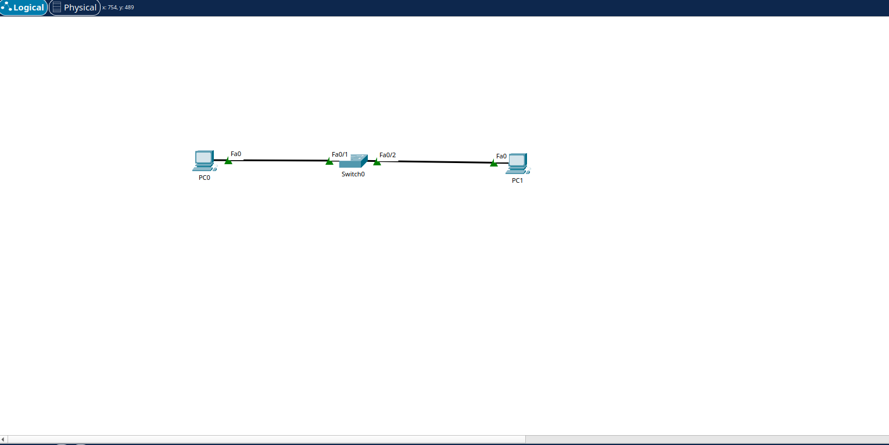

# Basic LAN, ARP and MAC Address Table Lab

The goal of this lab is to build a basic local area network using Cisco Packet Tracer and observe how devices communicate using IPv4, MAC addresses, ARP and ICMP.

## Topology


- 2 PCs
- 1 Cisco 2960 Switch

PC0 and PC1 are connected to the switch using FastEthernet interfaces.

## IP Addressing

| Device | IP Address | Subnet Mask |
| PC0 | 192.168.1.10 | 255.255.255.0 |
| PC1 | 192.168.1.20 | 255.255.255.0 |

No default gateway is required because both devices are in the same subnet.

## Connectivity Test

PC0 was used to ping PC1:
```bash
ping 192.168.1.20
```
The test completed successfully with 0% packet loss.

## ARP Observation

The ARP table on PC0 was checked using:
```bash
arp -a
```
PC0 learned the MAC address associated with PC1's IPv4 address.

## Switch MAC Address Table
The switch MAC address table was checked using:
enable
show mac address-table
The switch dynamically learned the MAC addresses of PC0 and PC1 and associated them with the correct FastEthernet ports.

## What I Learned
- How devices in the same subnet communicate
- The role of IPv4 addresses and subnet masks
- How ARP maps an IPv4 address to a MAC address
- How a switch dynamically learns MAC addresses
- How ICMP is used by the ping command
- How ARP and ICMP packets appear in Packet Tracer Simulation Mode
