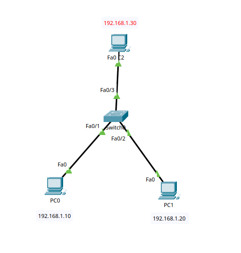

# Switching, ARP and MAC Address Table Lab

## Objective

The goal of this lab is to understand how a switch learns MAC addresses, how ARP works in a local network, and how frames are forwarded between devices.

## Topology



- 3 PCs
- 1 Cisco 2960 switch
- All devices are in the same IPv4 subnet

## IP Addressing

| Device | IP Address | Subnet Mask |
|---|---|---|
| PC0 | 192.168.1.10 | 255.255.255.0 |
| PC1 | 192.168.1.20 | 255.255.255.0 |
| PC2 | 192.168.1.30 | 255.255.255.0 |

No default gateway is required because all devices are in the same subnet.

## Connectivity Test

PC0 was used to communicate with PC1 and PC2:

```bash
ping 192.168.1.20
ping 192.168.1.30
```
The connectivity tests were successful.

## MAC Address Table
The switch MAC address table was checked using:
```bash
enable
show mac address-table
```
The switch dynamically learned the MAC addresses of the connected devices

## ARP and Flooding
Before communication, the dynamic MAC address table was cleared:
```bash
clear mac address-table dynamic
```
When PC0 tried to communicate with PC1, an ARP Request was sent as a broadcast frame.
The destination MAC address of the ARP Request was:
```bash
FFFF.FFFF.FFFF
```
The switch forwarded the broadcast frame through the other active ports.

After receiving frames from the connected devices, the switch learned their source MAC addresses.

Once the destination MAC address was known, the switch forwarded frames only through the port associated with the destination device.
## What I Learned
- How a switch dynamically learns MAC addresses
- How source MAC addresses are used to build the MAC address table
- How ARP discovers the MAC address associated with an IPv4 address
- Why ARP Requests are sent as broadcast frames
- How switches flood broadcast and unknown destination frames
- How a switch forwards frames directly after learning the destination MAC address
- How to inspect the MAC address table using Cisco IOS commands


