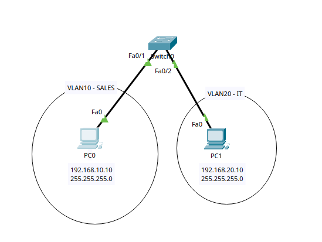

# VLAN Lab

## Objective

The goal of this lab is to understand how VLANs logically separate devices on the same physical switch and how access ports are assigned to different VLANs.

## Topology



- 2 PCs
- 1 Cisco 2960 switch
- 2 different VLANs
- VLAN 10 for SALES
- VLAN 20 for IT

## IP Addressing

| Device | IP Address | Subnet Mask | VLAN |
|---|---|---|---|
| PC0 | 192.168.10.10 | 255.255.255.0 | VLAN 10 |
| PC1 | 192.168.20.10 | 255.255.255.0 | VLAN 20 |

## VLAN Configuration

VLAN 10 and VLAN 20 were created on the switch:

```text
enable
configure terminal

vlan 10
name SALES
exit

vlan 20
name IT
exit
```
## Access Port Configuration

The switch ports were assigned to their respective VLANs:
```bash
interface fa0/1
switchport mode access
switchport access vlan 10
exit

interface fa0/2
switchport mode access
switchport access vlan 20
exit
```
## Verification
The VLAN configuration was verified using:
```bash
show vlan brief
```
The switch showed:
```text
VLAN 10  SALES  Fa0/1
VLAN 20  IT     Fa0/2
```
## Connectivity Test
PC0 attempted to ping PC1:
```bash
ping 192.168.20.10
```
The ping failed because the devices are in different VLANs and different IP subnets.
## What I Learned
- How to create VLANs on a Cisco switch
- How to assign names to VLANs
- How to configure switch ports as access ports
- How to assign access ports to specific VLANs
- How VLANs separate broadcast domains
- Why devices in different VLANs cannot communicate directly
- Why inter-VLAN routing is required for communication between VLANs
- How to verify VLAN configuration using show vlan brief


