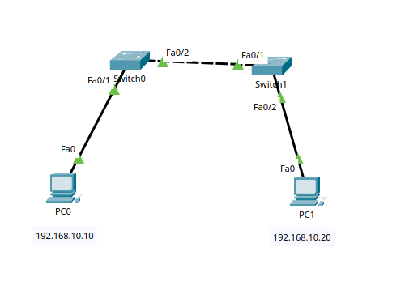

# Trunk Lab

## Objective

The goal of this lab is to understand how trunk links allow VLAN traffic to pass between multiple switches.

## Topology



- 2 PCs
- 2 Cisco 2960 switches
- VLAN 10 configured on both switches
- A trunk link configured between the switches

## IP Addressing

| Device | IP Address | Subnet Mask | VLAN |
|---|---|---|---|
| PC0 | 192.168.10.10 | 255.255.255.0 | VLAN 10 |
| PC1 | 192.168.10.20 | 255.255.255.0 | VLAN 10 |

Both devices are in the same IPv4 subnet and the same VLAN.

## VLAN Configuration

VLAN 10 was created on both switches:

```bash
enable
configure terminal

vlan 10
name SALES
exit
```
## Access Port Configuration
On Switch0, PC0 is connected to Fa0/1:
```bash
interface fa0/1
switchport mode access
switchport access vlan 10
exit
```
On Switch1, PC1 is connected to Fa0/2:
```bash
interface fa0/2
switchport mode access
switchport access vlan 10
exit
```
## Trunk Configuration
The link between the two switches was configured as a trunk.
Switch0:
```bash
interface fa0/2
switchport mode trunk
exit
```
Switch1:
```bash
interface fa0/1
switchport mode trunk
exit
```

## Verification
The VLAN configuration was checked using:
```bash
show vlan brief
```
The trunk link was checked using:
```bash
show interfaces trunk
```
## Connectivity Test

PC0 was used to ping PC1:
```bash
ping 192.168.10.20
```
The ping was successful after the access ports were assigned to VLAN 10 and the switch-to-switch link was configured as a trunk.
## What I Learned
- How to create the same VLAN on multiple switches
- How to configure access ports
- How to configure a trunk link between switches
- Why switch-to-switch links are commonly configured as trunk ports
- How VLAN traffic can travel between multiple switches
- How to verify trunk configuration using show interfaces trunk
- How incorrect VLAN assignments can cause connectivity problems
- How to troubleshoot VLAN and trunk configuration errors
