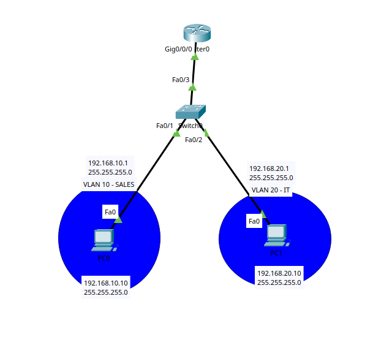

# Inter-VLAN Routing Lab

## Objective

The goal of this lab is to understand how devices in different VLANs can communicate using Router-on-a-Stick.

A single physical router interface is divided into multiple subinterfaces, and each subinterface is associated with a different VLAN using IEEE 802.1Q encapsulation.

## Topology



- 2 PCs
- 1 Cisco switch
- 1 router
- VLAN 10 for SALES
- VLAN 20 for IT
- 1 trunk link between the switch and router

## IP Addressing

| Device | IP Address | Subnet Mask | Default Gateway | VLAN |
|---|---|---|---|---|
| PC0 | 192.168.10.10 | 255.255.255.0 | 192.168.10.1 | VLAN 10 |
| PC1 | 192.168.20.10 | 255.255.255.0 | 192.168.20.1 | VLAN 20 |
| Router G0/0/0.10 | 192.168.10.1 | 255.255.255.0 | - | VLAN 10 |
| Router G0/0/0.20 | 192.168.20.1 | 255.255.255.0 | - | VLAN 20 |

## VLAN Configuration

VLAN 10 and VLAN 20 were created on the switch:

```bash
enable
configure terminal

vlan 10
name SALES
exit

vlan 20
name IT
exit
```
## Access Port Configuration
PC0 was assigned to VLAN 10:
```bash
interface fa0/1
switchport mode access
switchport access vlan 10
exit
```

PC1 was assigned to VLAN 20:
```bash
interface fa0/2
switchport mode access
switchport access vlan 20
exit
```
## Trunk Configuration
The switch port connected to the router was configured as a trunk:
```bash
interface fa0/24
switchport mode trunk
exit
```
## Router-on-a-Stick Configuration
The physical router interface was enabled:
```bash
enable
configure terminal

interface gigabitEthernet 0/0/0
no shutdown
exit
```
A subinterface was created for VLAN 10:
```bash
interface gigabitEthernet 0/0/0.10
encapsulation dot1Q 10
ip address 192.168.10.1 255.255.255.0
exit
```
A second subinterface was created for VLAN 20:
```bash
interface gigabitEthernet 0/0/0.20
encapsulation dot1Q 20
ip address 192.168.20.1 255.255.255.0
exit
```
## 802.1Q Encapsulation
```bash
encapsulation dot1Q 20
```
## Connectivity Test
PC0 was used to ping PC1:
```bash
ping 192.168.20.10
```
The ping was successful.
## What I Learned
- Why devices in different VLANs cannot communicate directly
- How inter-VLAN routing enables communication between VLANs
- How Router-on-a-Stick works
- How to configure router subinterfaces
- How IEEE 802.1Q VLAN tagging works
- What the encapsulation dot1Q command does
- How one physical router interface can support multiple VLANs
- Why each VLAN requires its own default gateway
- How trunk links carry multiple VLANs


