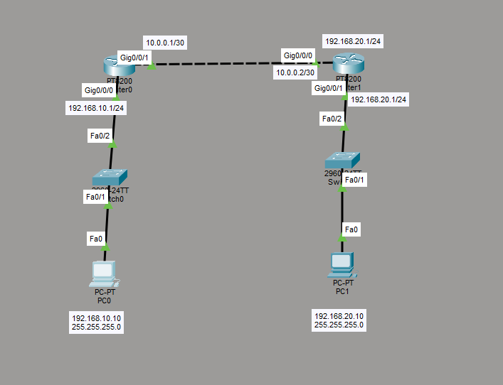

# Static Routing Lab

## Objective

The goal of this lab is to understand how static routes allow routers to reach remote networks that are not directly connected.

Two separate LANs were connected through two routers, and static routes were configured manually on both routers.

## Topology



- 2 PCs
- 2 Cisco switches
- 2 routers
- 2 different LANs
- 1 point-to-point router connection

## IP Addressing

| Device | Interface | IP Address | Subnet Mask | Default Gateway |
|---|---|---|---|---|
| PC0 | FastEthernet0 | 192.168.10.10 | 255.255.255.0 | 192.168.10.1 |
| Router0 | G0/0/0 | 192.168.10.1 | 255.255.255.0 | - |
| Router0 | G0/0/1 | 10.0.0.1 | 255.255.255.252 | - |
| Router1 | G0/0/0 | 10.0.0.2 | 255.255.255.252 | - |
| Router1 | G0/0/1 | 192.168.20.1 | 255.255.255.0 | - |
| PC1 | FastEthernet0 | 192.168.20.10 | 255.255.255.0 | 192.168.20.1 |

## Router-to-Router Network

The connection between the two routers uses:

```text
10.0.0.0/30
```

Subnet mask:

```text
255.255.255.252
```

A `/30` network provides two usable host addresses, which is suitable for a point-to-point connection between two routers.

```text
10.0.0.0 → Network Address
10.0.0.1 → Router0
10.0.0.2 → Router1
10.0.0.3 → Broadcast Address
```

## Router0 Configuration

```text
enable
configure terminal

interface g0/0/0
ip address 192.168.10.1 255.255.255.0
no shutdown
exit

interface g0/0/1
ip address 10.0.0.1 255.255.255.252
no shutdown
exit
```

## Router1 Configuration

```text
enable
configure terminal

interface g0/0/0
ip address 10.0.0.2 255.255.255.252
no shutdown
exit

interface g0/0/1
ip address 192.168.20.1 255.255.255.0
no shutdown
exit
```

## Static Route Configuration

Router0 needs a route to the remote `192.168.20.0/24` network:

```text
ip route 192.168.20.0 255.255.255.0 10.0.0.2
```

This tells Router0 to forward packets destined for `192.168.20.0/24` to Router1 at `10.0.0.2`.

Router1 also needs a return route to the `192.168.10.0/24` network:

```text
ip route 192.168.10.0 255.255.255.0 10.0.0.1
```

This tells Router1 to forward packets destined for `192.168.10.0/24` to Router0 at `10.0.0.1`.

## Route Verification

The routing table was checked using:

```text
show ip route
```
## Connectivity Test

PC0 was used to ping PC1:

```bash
ping 192.168.20.10
```

During the first connectivity test, the first packets timed out while ARP information was being learned.

After the ARP tables were populated, the next ping test completed successfully with 4 out of 4 replies.

## What I Learned

- How routers learn directly connected networks
- Why routers need routes to reach remote networks
- How to configure static routes
- What a next-hop IP address is
- Why routing is required in both directions
- How to verify routes using `show ip route`
- Why `/30` networks are useful for point-to-point router links
- How ARP can affect the first connectivity test
- How packets travel across multiple routers
