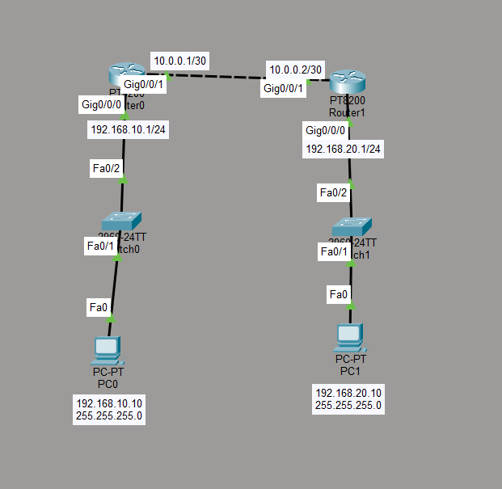

# Default Routing Lab

## Objective

The goal of this lab is to understand how a default route is used when a router does not have a more specific route to a destination network.
Instead of configuring a separate static route for every remote network, a default route can forward unknown traffic to a specified next-hop router.

## Topology



- 2 PCs
- 2 Cisco switches
- 2 routers
- 2 different LANs
- 1 point-to-point router connection
- 1 default route
- 1 return static route

## IP Addressing

| Device | Interface | IP Address | Subnet Mask | Default Gateway |
|---|---|---|---|---|
| PC0 | FastEthernet0 | 192.168.10.10 | 255.255.255.0 | 192.168.10.1 |
| Router0 | G0/0/0 | 192.168.10.1 | 255.255.255.0 | - |
| Router0 | G0/0/1 | 10.0.0.1 | 255.255.255.252 | - |
| Router1 | G0/0/0 | 10.0.0.2 | 255.255.255.252 | - |
| Router1 | G0/0/1 | 192.168.20.1 | 255.255.255.0 | - |
| PC1 | FastEthernet0 | 192.168.20.10 | 255.255.255.0 | 192.168.20.1 |

## Router0 Configuration

```text
enable
configure terminal

interface g0/0/0
ip address 192.168.10.1 255.255.255.0
no shutdown
exit

interface g0/0/1
ip address 10.0.0.1 255.255.255.252
no shutdown
exit
```

## Router1 Configuration

```text
enable
configure terminal

interface g0/0/0
ip address 10.0.0.2 255.255.255.252
no shutdown
exit

interface g0/0/1
ip address 192.168.20.1 255.255.255.0
no shutdown
exit
```

## Default Route Configuration

Router0 was configured with a default route:

```text
ip route 0.0.0.0 0.0.0.0 10.0.0.2
```

This means that if Router0 does not have a more specific route to a destination, it forwards the packet to Router1 at `10.0.0.2`.

A `/0` route matches any IPv4 destination that does not have a more specific route in the routing table.

## Return Route

Router1 requires a route back to the `192.168.10.0/24` network:

```text
ip route 192.168.10.0 255.255.255.0 10.0.0.1
```

This provides the return path for traffic sent from PC1 to PC0.

## Route Verification

The routing table was checked using:

```text
show ip route
```

The default route appears with:
```text
S*
```

`S` indicates a static route and `*` indicates a candidate default route.

## Connectivity Test

PC0 was used to ping PC1:

```bash
ping 192.168.20.10
```

The ping was successful.

This confirmed that Router0 used the default route to forward traffic toward Router1.

## Static Route vs Default Route

A normal static route defines a path to a specific network:

```text
ip route 192.168.20.0 255.255.255.0 10.0.0.2
```

This route only applies to the `192.168.20.0/24` network.

A default route is more general:

```text
ip route 0.0.0.0 0.0.0.0 10.0.0.2
```

This route is used when no more specific route exists.


Router0 checks its routing table first.

If no more specific route matches the destination, the packet is forwarded to the default next-hop router.

## What I Learned

- What a default route is
- How `0.0.0.0/0` represents all IPv4 destinations
- How to configure a default route
- How a default route differs from a specific static route
- What a next-hop IP address is
- Why a return route is still required
- How to verify a default route using `show ip route`
- What `S*` means in the Cisco routing table
- How routers forward traffic when no more specific route exists
