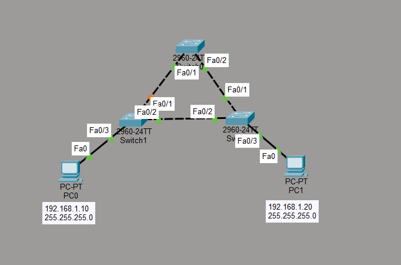

# Spanning Tree Protocol (STP) Lab

## Objective

The goal of this lab is to understand how Spanning Tree Protocol prevents Layer 2 loops in a redundant switched network.

Three switches were connected in a triangle topology to create redundant Layer 2 paths.

## Topology



- 3 Cisco switches
- 2 PCs
- Redundant switch-to-switch links
- STP enabled by default

## IP Addressing

| Device | IP Address | Subnet Mask |
|---|---|---|
| PC0 | 192.168.1.10 | 255.255.255.0 |
| PC1 | 192.168.1.20 | 255.255.255.0 |

Both PCs are in the same IPv4 subnet.

## STP Verification

STP information was checked using:

```text
show spanning-tree
```

One switch was automatically elected as the Root Bridge.

The Root Bridge showed:

```text
This bridge is the root
```

The Root ID and Bridge ID were also the same.

## Root Bridge Election

All switches initially had the same STP priority.

Because the priorities were equal, the switch with the lowest Bridge ID was selected as the Root Bridge.

In this topology, Switch2 became the Root Bridge.

## Port Roles

STP assigned different roles to switch ports.

Examples observed during the lab:

```text
Root FWD
Desg FWD
Altn BLK
```

- `Root FWD` represents the best path toward the Root Bridge.
- `Desg FWD` represents a designated forwarding port.
- `Altn BLK` represents an alternate path that is blocked to prevent a Layer 2 loop.

## Loop Prevention

Because the three switches were connected in a triangle, multiple Layer 2 paths existed between devices.

STP automatically placed one redundant port into a blocking state.

Example:

```text
Fa0/1  Altn BLK
```

This prevented Ethernet frames from continuously circulating through the switching loop.

## Redundant Path Test

An active link was temporarily disabled to simulate a link failure.

```text
enable
configure terminal
interface fa0/2
shutdown
```

After STP recalculated the topology, the previously blocked alternate path could become active and forward traffic.

The interface was then enabled again:

```text
interface fa0/2
no shutdown
```

This demonstrated how STP provides redundancy while preventing Layer 2 loops.

## What I Learned

- Why Layer 2 loops are dangerous
- How STP prevents switching loops
- How a Root Bridge is elected
- How Bridge ID affects Root Bridge selection
- What Root, Designated and Alternate port roles mean
- Why some redundant ports are placed into a blocking state
- How STP maintains a backup path
- How STP reacts when an active network link fails
- How to inspect STP using `show spanning-tree`
