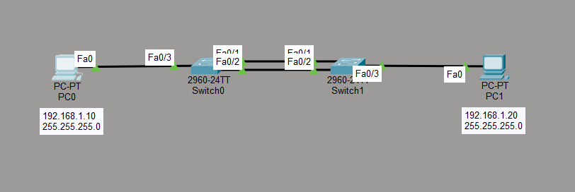

# EtherChannel Lab

## Objective

The goal of this lab is to understand how EtherChannel combines multiple physical links into a single logical link.

This provides increased bandwidth and redundancy between switches while allowing Spanning Tree Protocol to treat the bundled links as one logical connection.

## Topology



- 2 PCs
- 2 Cisco switches
- 2 physical links between the switches
- 1 EtherChannel
- LACP used for negotiation

## IP Addressing

| Device | IP Address | Subnet Mask |
|---|---|---|
| PC0 | 192.168.1.10 | 255.255.255.0 |
| PC1 | 192.168.1.20 | 255.255.255.0 |

Both PCs are in the same IPv4 subnet.

## EtherChannel Configuration

On both switches, FastEthernet0/1 and FastEthernet0/2 were grouped into the same EtherChannel.

```text
enable
configure terminal

interface range fa0/1 - 2
switchport mode trunk
channel-group 1 mode active
no shutdown
exit
```

The logical Port-Channel interface was also configured as a trunk:

```text
interface port-channel 1
switchport mode trunk
exit
```

## LACP

This lab uses LACP, which stands for Link Aggregation Control Protocol.

The following command enables LACP in active mode:

```text
channel-group 1 mode active
```

LACP allows the switches on both sides of the connection to negotiate and form an EtherChannel.

The configuration must be compatible on both switches for the EtherChannel to form correctly.

## Verification

The EtherChannel status was checked using:

```text
show etherchannel summary
```

Before both switches were configured correctly, the output showed:

```text
Po1(SD)
Fa0/1(I)
Fa0/2(I)
```

The ports were in stand-alone mode and the Port-Channel was down.

After configuring LACP correctly on both switches, the output changed to:

```text
Po1(SU)
Fa0/1(P)
Fa0/2(P)
```

Where:

- `Po1` represents Port-Channel 1
- `S` means Layer 2
- `U` means the Port-Channel is in use
- `P` means the physical interface is bundled into the Port-Channel

## Connectivity Test

PC0 was used to ping PC1:

```bash
ping 192.168.1.20
```

The ping was successful.

This confirmed that communication between the two switches was working through the EtherChannel.

## EtherChannel and STP

Without EtherChannel, multiple parallel Layer 2 links between switches can create a switching loop.

STP may block one of the redundant links to prevent this loop.

With EtherChannel, multiple physical links are grouped together and presented to STP as a single logical connection.

```text
Fa0/1 + Fa0/2
      ↓
Port-Channel 1
```

This allows the links to be used together instead of STP treating them as completely separate paths.

## Benefits of EtherChannel

EtherChannel provides two important advantages:

### Increased Bandwidth

Traffic can be distributed across multiple physical links instead of relying on only one connection.

### Redundancy

If one physical link in the EtherChannel fails, communication can continue through the remaining active link.

This improves network availability.

## What I Learned

- What EtherChannel is
- How multiple physical links can form one logical link
- How to configure an EtherChannel
- How LACP works
- Why LACP configuration is required on both switches
- What `channel-group 1 mode active` does
- How to verify EtherChannel using `show etherchannel summary`
- What `Po1(SU)` means
- What the `(P)` flag means
- How EtherChannel provides additional bandwidth
- How EtherChannel provides redundancy
- How EtherChannel interacts with Spanning Tree Protocol
