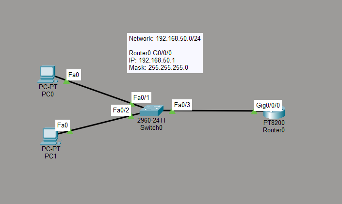

# DHCP Lab

## Objective

The goal of this lab is to understand how DHCP automatically assigns IP configuration to client devices.

In this lab, the router was configured as a DHCP server and dynamically assigned IP addresses to PCs on the local network.

## Topology



- 2 PCs
- 1 Cisco switch
- 1 router
- 1 DHCP pool
- Automatic IP address assignment

## Network Information

```text
Network: 192.168.50.0/24
Default Gateway: 192.168.50.1
```

The router interface was configured with:

```text
192.168.50.1
255.255.255.0
```

## Router Interface Configuration

```text
enable
configure terminal

interface g0/0/0
ip address 192.168.50.1 255.255.255.0
no shutdown
exit
```

## Excluded Addresses

Some IP addresses were excluded from the DHCP pool:

```text
ip dhcp excluded-address 192.168.50.1 192.168.50.10
```

This prevents DHCP from assigning these addresses to client devices.

The excluded addresses can be reserved for devices that require static IP addresses, such as:

- Routers
- Servers
- Printers
- Network management devices

## DHCP Pool Configuration

A DHCP pool named `LAN` was created:

```text
ip dhcp pool LAN
network 192.168.50.0 255.255.255.0
default-router 192.168.50.1
dns-server 8.8.8.8
exit
```

The DHCP pool provides clients with:

- IPv4 address
- Subnet mask
- Default gateway
- DNS server

## DHCP Client Configuration

The PCs were configured to obtain their IP configuration automatically using DHCP.

After enabling DHCP, PC0 received:

```text
IPv4 Address: 192.168.50.11
Subnet Mask: 255.255.255.0
Default Gateway: 192.168.50.1
```

The address `192.168.50.11` was assigned because the addresses from `192.168.50.1` through `192.168.50.10` were excluded from the DHCP pool.

## Connectivity Test

PC0 was used to ping the default gateway:

```bash
ping 192.168.50.1
```

The ping completed successfully with 4 out of 4 replies.

This confirmed that the client received a valid IP configuration from the DHCP server.

## DHCP DORA Process

The DHCP process was observed using Packet Tracer Simulation Mode.

The client obtains an IP address using four main steps:

```text
Discover
   ↓
Offer
   ↓
Request
   ↓
Acknowledge
```

This process is commonly called DORA.

### DHCP Discover

The client sends a DHCP Discover message to find a DHCP server on the network.

### DHCP Offer

The DHCP server responds by offering an available IP address to the client.

### DHCP Request

The client sends a DHCP Request message indicating that it wants to use the offered IP address.

### DHCP Acknowledge

The DHCP server sends a DHCP ACK message to confirm the assignment.

After this process is completed, the client can use the assigned IP configuration.

## Why DHCP Is Useful

Without DHCP, IP addresses, subnet masks, default gateways and DNS addresses would need to be configured manually on every client device.

DHCP automates this process and makes network administration easier, especially in networks with many devices.

## What I Learned

- What DHCP is
- How a router can operate as a DHCP server
- How to create a DHCP pool
- Why IP addresses are excluded from a DHCP pool
- How clients automatically receive IP addresses
- How default gateway information is distributed through DHCP
- How DNS information can be distributed through DHCP
- What the DHCP DORA process is
- How Discover, Offer, Request and Acknowledge messages work
- How to verify DHCP configuration using Packet Tracer
