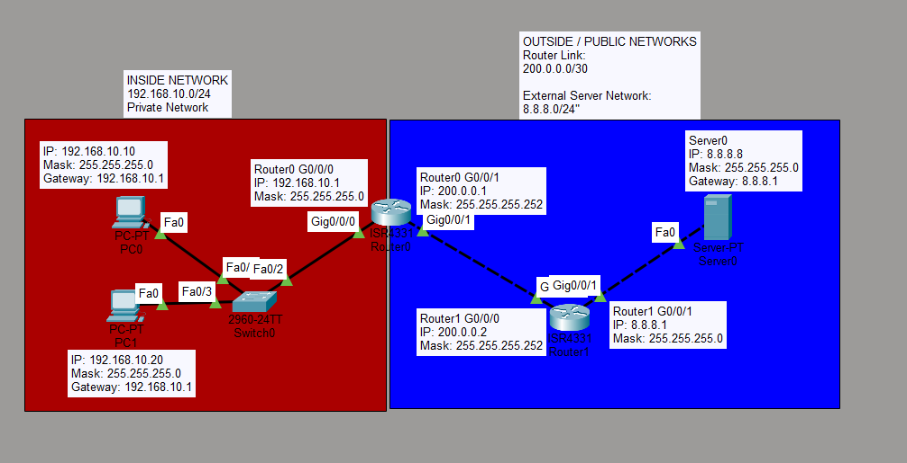

# NAT and PAT Lab

## Objective

The goal of this lab is to understand how Network Address Translation (NAT) and Port Address Translation (PAT) allow multiple private IPv4 addresses to communicate with an external network using a single global IP address.

In this lab, two PCs in a private network access an external server through a router configured with NAT overload.

## Topology



The topology contains:

- 2 PCs in the private network
- 1 Cisco switch
- 2 routers
- 1 external server
- 1 inside private network
- 1 router-to-router external network
- 1 external server network

## Network Information

### Inside Network

```text
Network: 192.168.10.0/24
```

| Device | IP Address | Subnet Mask | Default Gateway |
|---|---|---|---|
| PC0 | 192.168.10.10 | 255.255.255.0 | 192.168.10.1 |
| PC1 | 192.168.10.20 | 255.255.255.0 | 192.168.10.1 |
| Router0 G0/0/0 | 192.168.10.1 | 255.255.255.0 | - |

### Router-to-Router Network

```text
Network: 200.0.0.0/30
```

| Device | IP Address | Subnet Mask |
|---|---|---|
| Router0 G0/0/1 | 200.0.0.1 | 255.255.255.252 |
| Router1 G0/0/0 | 200.0.0.2 | 255.255.255.252 |

### External Server Network

```text
Network: 8.8.8.0/24
```

| Device | IP Address | Subnet Mask | Default Gateway |
|---|---|---|---|
| Router1 G0/0/1 | 8.8.8.1 | 255.255.255.0 | - |
| Server0 | 8.8.8.8 | 255.255.255.0 | 8.8.8.1 |

## Router0 Interface Configuration

The inside interface was configured as:

```text
enable
configure terminal

interface g0/0/0
ip address 192.168.10.1 255.255.255.0
ip nat inside
no shutdown
exit
```

The outside interface was configured as:

```text
interface g0/0/1
ip address 200.0.0.1 255.255.255.252
ip nat outside
no shutdown
exit
```

The `ip nat inside` command identifies the interface connected to the private network.

The `ip nat outside` command identifies the interface connected to the external network.

## Router1 Configuration

```text
enable
configure terminal

interface g0/0/0
ip address 200.0.0.2 255.255.255.252
no shutdown
exit

interface g0/0/1
ip address 8.8.8.1 255.255.255.0
no shutdown
exit
```

## NAT Access List

The private network was permitted for NAT using:

```text
access-list 1 permit 192.168.10.0 0.0.0.255
```

This access list matches devices in the `192.168.10.0/24` private network.

## NAT Overload Configuration

PAT was configured using:

```text
ip nat inside source list 1 interface g0/0/1 overload
```

This command translates traffic from the private network to the IP address assigned to Router0's outside interface.

The `overload` keyword allows multiple private devices to share the same global IP address.

## Default Route

Router0 was configured with a default route toward Router1:

```text
ip route 0.0.0.0 0.0.0.0 200.0.0.2
```

This tells Router0 to forward unknown external traffic to Router1.

Router1 was configured with a return route toward the inside network:

```text
ip route 192.168.10.0 255.255.255.0 200.0.0.1
```

## Connectivity Test

Both PCs were used to ping the external server:

```bash
ping 8.8.8.8
```

The connectivity tests were successful.

This confirmed that both private hosts could reach the external server through NAT/PAT.

## NAT Translation Table

The translation table was checked using:

```text
show ip nat translations
```

Example output:

```text
Pro  Inside global     Inside local       Outside local      Outside global

icmp 200.0.0.1:1       192.168.10.10:1    8.8.8.8:1          8.8.8.8:1
icmp 200.0.0.1:2       192.168.10.10:2    8.8.8.8:2          8.8.8.8:2
```

After traffic was generated from both PCs, multiple private addresses appeared in the NAT translation table while using the same global IP address.

Example:

```text
192.168.10.10 ─┐
                ├──> 200.0.0.1
192.168.10.20 ─┘
```

## Inside Local and Inside Global

`Inside local` represents the private IP address used by a device inside the local network.

Example:

```text
192.168.10.10
```

`Inside global` represents the address that identifies the inside device to the external network.

In this lab:

```text
200.0.0.1
```

Multiple private devices can share this same global address because PAT distinguishes their connections using port or protocol identification information.

## Why NAT/PAT Is Useful

NAT and PAT provide several important benefits:

- Multiple private devices can share one global IPv4 address
- Public IPv4 addresses can be conserved
- Private addressing can be used inside local networks
- Internal addresses do not need to be directly exposed to external networks
- Internet access can be provided to many devices through a single external address

NAT should not be considered a replacement for a firewall or other security controls.

## Traffic Flow

```text
PC0 192.168.10.10 ─┐
                    │
PC1 192.168.10.20 ──┤
                    ↓
                 Router0
                  NAT/PAT
                    ↓
                 200.0.0.1
                    ↓
                 Router1
                    ↓
              Server0 8.8.8.8
```

## What I Learned

- What NAT is
- What PAT / NAT overload is
- The difference between inside and outside interfaces
- How to configure `ip nat inside`
- How to configure `ip nat outside`
- How an access list identifies addresses that should be translated
- How multiple private IP addresses can share one global IP address
- What inside local and inside global addresses mean
- How to verify translations using `show ip nat translations`
- Why NAT helps conserve public IPv4 addresses
- How private hosts communicate with external networks through NAT
