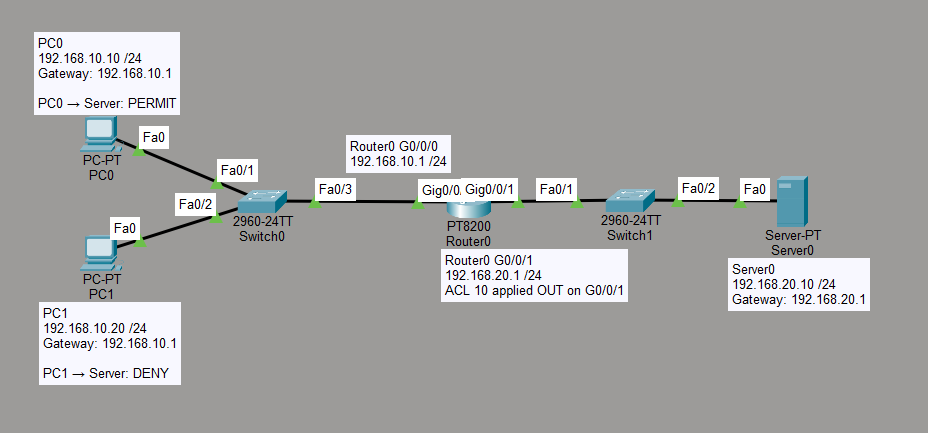

# Access Control List (ACL) Lab

## Objective

The goal of this lab is to understand how a Standard Access Control List (ACL) can be used to control traffic between different networks.

In this lab, PC0 is allowed to reach the server while PC1 is blocked by a Standard ACL configured on the router.

## Topology



The topology contains:

- 2 PCs
- 2 Cisco switches
- 1 router
- 1 server
- 2 different IPv4 networks
- 1 Standard ACL

## Network Information

### Client Network

```text
Network: 192.168.10.0/24
```

| Device | IP Address | Subnet Mask | Default Gateway |
|---|---|---|---|
| PC0 | 192.168.10.10 | 255.255.255.0 | 192.168.10.1 |
| PC1 | 192.168.10.20 | 255.255.255.0 | 192.168.10.1 |
| Router0 G0/0/0 | 192.168.10.1 | 255.255.255.0 | - |

### Server Network

```text
Network: 192.168.20.0/24
```

| Device | IP Address | Subnet Mask | Default Gateway |
|---|---|---|---|
| Router0 G0/0/1 | 192.168.20.1 | 255.255.255.0 | - |
| Server0 | 192.168.20.10 | 255.255.255.0 | 192.168.20.1 |

## Router Configuration

```text
enable
configure terminal

interface g0/0/0
ip address 192.168.10.1 255.255.255.0
no shutdown
exit

interface g0/0/1
ip address 192.168.20.1 255.255.255.0
no shutdown
exit
```

## Connectivity Test Before ACL

Before configuring the ACL, both PCs were able to reach the server.

From PC0:

```bash
ping 192.168.20.10
```

From PC1:

```bash
ping 192.168.20.10
```

Both connectivity tests were successful.

## Standard ACL Configuration

A Standard ACL was created on Router0:

```text
access-list 10 deny host 192.168.10.20
access-list 10 permit any
```

The first rule blocks PC1:

```text
192.168.10.20
```

The second rule allows all other source addresses:

```text
permit any
```

## Applying the ACL

The ACL was applied to the interface connected to the server network:

```text
interface g0/0/1
ip access-group 10 out
exit
```

The `out` keyword means that the ACL checks packets leaving Router0 through the `G0/0/1` interface.

## Connectivity Test After ACL

PC0 was still able to reach the server:

```bash
ping 192.168.20.10
```

PC1 was blocked by the ACL.

PC1 received:

```text
Reply from 192.168.10.1: Destination host unreachable.
```

This confirmed that the ACL was working correctly.

## ACL Logic

The ACL processes rules from top to bottom.

```text
access-list 10 deny host 192.168.10.20
access-list 10 permit any
```

The router first checks whether the source address is `192.168.10.20`.

If it matches, the packet is denied.

If it does not match, the router continues to the next rule and permits the traffic.

## Why `permit any` Is Important

ACLs contain an implicit deny rule at the end.

Conceptually, every ACL ends with:

```text
deny any
```

If the following rule was not configured:

```text
access-list 10 permit any
```

traffic from other devices such as PC0 could also be blocked.

## Standard ACL

A Standard ACL mainly filters traffic based on the source IPv4 address.

In this lab:

```text
PC0 192.168.10.10 → PERMIT
PC1 192.168.10.20 → DENY
```

The ACL does not check application ports or specific destination services.

For more detailed filtering, an Extended ACL can be used.

## Traffic Flow

```text
PC0 192.168.10.10
        |
        | PERMIT
        v
      Router0
        |
        v
Server0 192.168.20.10


PC1 192.168.10.20
        |
        | DENY
        X
      Router0
```

## Why ACLs Are Useful

ACLs can be used to control access between different parts of a network.

Examples include:

- Blocking specific hosts
- Restricting access between departments
- Preventing guest networks from accessing internal servers
- Allowing only authorized devices to reach network resources
- Controlling traffic between different network segments

ACLs provide basic traffic filtering but should not be considered a complete replacement for a firewall.

## What I Learned

- What an Access Control List is
- How a Standard ACL works
- How to deny traffic from a specific host
- How to permit all other traffic
- Why ACL rule order is important
- What the implicit `deny any` rule means
- How to apply an ACL to a router interface
- What `in` and `out` mean when applying an ACL
- How ACLs can control access between networks
- The difference between permitted and denied traffic
- Why Extended ACLs provide more detailed traffic filtering
