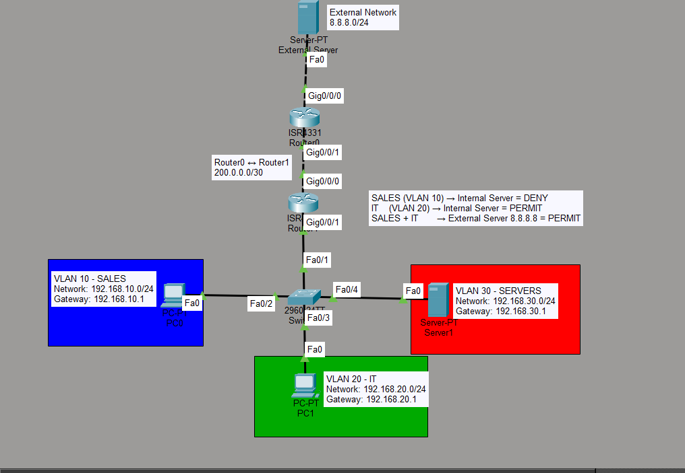

# Small Office Network Lab

## Objective

The goal of this final lab is to combine multiple networking concepts into a small office network.

The network includes VLAN segmentation, trunking, inter-VLAN routing, DHCP, an internal server, NAT/PAT, default routing, an external network and Access Control Lists.

## Topology



The topology contains:

- 2 client PCs
- 1 internal server
- 1 external server
- 1 Cisco switch
- 2 routers
- 3 VLANs
- DHCP
- Router-on-a-Stick
- NAT/PAT
- Default routing
- Extended ACL

## Network Design

### VLAN 10 - SALES

```text
Network: 192.168.10.0/24
Gateway: 192.168.10.1
```

PC0 receives its IP configuration automatically using DHCP.

Example:

```text
IP Address: 192.168.10.11
Subnet Mask: 255.255.255.0
Default Gateway: 192.168.10.1
```

### VLAN 20 - IT

```text
Network: 192.168.20.0/24
Gateway: 192.168.20.1
```

PC1 also receives its IP configuration automatically using DHCP.

Example:

```text
IP Address: 192.168.20.11
Subnet Mask: 255.255.255.0
Default Gateway: 192.168.20.1
```

### VLAN 30 - SERVERS

```text
Network: 192.168.30.0/24
Gateway: 192.168.30.1
```

The internal server uses a static IP address:

```text
Server1
IP Address: 192.168.30.10
Subnet Mask: 255.255.255.0
Default Gateway: 192.168.30.1
```

### Router-to-Router Network

```text
Network: 200.0.0.0/30
```

The office router and external router are connected using this point-to-point network.

```text
Office Router:   200.0.0.1
External Router: 200.0.0.2
```

### External Network

```text
Network: 8.8.8.0/24
```

The external server uses:

```text
IP Address: 8.8.8.8
Subnet Mask: 255.255.255.0
Default Gateway: 8.8.8.1
```

## VLAN Configuration

Three VLANs were created on the switch:

```text
enable
configure terminal

vlan 10
name SALES
exit

vlan 20
name IT
exit

vlan 30
name SERVERS
exit
```

## Access Port Configuration

The client and server ports were assigned to their VLANs.

```text
interface fa0/2
switchport mode access
switchport access vlan 10
exit

interface fa0/3
switchport mode access
switchport access vlan 20
exit

interface fa0/4
switchport mode access
switchport access vlan 30
exit
```

## Trunk Configuration

The switch port connected to the office router was configured as a trunk:

```text
interface fa0/1
switchport mode trunk
exit
```

The trunk carries VLAN 10, VLAN 20 and VLAN 30 traffic between the switch and router.

## Router-on-a-Stick Configuration

The office router uses subinterfaces to route traffic between VLANs.

### VLAN 10

```text
interface gigabitEthernet0/0/1.10
encapsulation dot1Q 10
ip address 192.168.10.1 255.255.255.0
ip nat inside
exit
```

### VLAN 20

```text
interface gigabitEthernet0/0/1.20
encapsulation dot1Q 20
ip address 192.168.20.1 255.255.255.0
ip nat inside
exit
```

### VLAN 30

```text
interface gigabitEthernet0/0/1.30
encapsulation dot1Q 30
ip address 192.168.30.1 255.255.255.0
ip nat inside
exit
```

Each subinterface acts as the default gateway for its VLAN.

## DHCP Configuration

IP addresses were excluded from the DHCP pools so they could be reserved for gateways and other static devices.

```text
ip dhcp excluded-address 192.168.10.1 192.168.10.10
ip dhcp excluded-address 192.168.20.1 192.168.20.10
```

### SALES DHCP Pool

```text
ip dhcp pool SALES
network 192.168.10.0 255.255.255.0
default-router 192.168.10.1
dns-server 8.8.8.8
exit
```

### IT DHCP Pool

```text
ip dhcp pool IT
network 192.168.20.0 255.255.255.0
default-router 192.168.20.1
dns-server 8.8.8.8
exit
```

PC0 and PC1 successfully received IP addresses from their respective DHCP pools.

## Inter-VLAN Routing

Router-on-a-Stick allows the router to route traffic between VLAN 10, VLAN 20 and VLAN 30.

```text
VLAN 10
192.168.10.0/24
       ↓
Office Router
       ↓
VLAN 30
192.168.30.0/24
```

Before applying the ACL, devices in different VLANs were able to communicate through the router.

## Outside Interface

The office router interface connected to the external router was configured as:

```text
interface gigabitEthernet0/0/0
ip address 200.0.0.1 255.255.255.252
ip nat outside
no shutdown
exit
```

## External Router Configuration

The external router was configured with the router-to-router network and the external server network.

```text
interface gigabitEthernet0/0/0
ip address 200.0.0.2 255.255.255.252
no shutdown
exit

interface gigabitEthernet0/0/1
ip address 8.8.8.1 255.255.255.0
no shutdown
exit
```

## Default Route

The office router was configured with a default route toward the external router:

```text
ip route 0.0.0.0 0.0.0.0 200.0.0.2
```

This tells the router to forward traffic toward the external router when no more specific route exists.

## NAT Access List

The internal VLAN networks were selected for NAT:

```text
access-list 1 permit 192.168.10.0 0.0.0.255
access-list 1 permit 192.168.20.0 0.0.0.255
access-list 1 permit 192.168.30.0 0.0.0.255
```

## NAT/PAT Configuration

NAT overload was configured using:

```text
ip nat inside source list 1 interface gigabitEthernet0/0/0 overload
```

This allows multiple private devices to share the same global IP address.

For example:

```text
192.168.10.11 ─┐
                ├──> 200.0.0.1
192.168.20.11 ─┘
```

Both clients successfully reached the external server at:

```text
8.8.8.8
```

## NAT Verification

NAT translations were verified using:

```text
show ip nat translations
```

Example translations included:

```text
Inside local       Inside global
192.168.10.11  →   200.0.0.1
192.168.20.11  →   200.0.0.1
```

This confirmed that PAT was working correctly.

## Extended ACL

An Extended ACL was used to implement an access control policy.

The required policy was:

```text
SALES → Internal Server = DENY
IT    → Internal Server = PERMIT
SALES → External Server = PERMIT
IT    → External Server = PERMIT
```

The ACL was configured as:

```text
access-list 100 deny ip 192.168.10.0 0.0.0.255 host 192.168.30.10
access-list 100 permit ip any any
```

The first rule blocks traffic from the SALES network to the internal server.

The second rule allows all other IP traffic.

## Applying the ACL

The ACL was applied inbound on the SALES VLAN subinterface:

```text
interface gigabitEthernet0/0/1.10
ip access-group 100 in
exit
```

The `in` keyword means that traffic entering the router from VLAN 10 is checked by ACL 100.

## ACL Verification

After applying the ACL:

```text
PC0 / SALES → 192.168.30.10 = BLOCKED
PC1 / IT    → 192.168.30.10 = ALLOWED
PC0 / SALES → 8.8.8.8       = ALLOWED
PC1 / IT    → 8.8.8.8       = ALLOWED
```

This confirmed that the access control policy was working correctly.

## What I Learned

- How to design a small office network
- How to segment departments using VLANs
- How to configure access ports
- How to configure a trunk link
- How Router-on-a-Stick enables inter-VLAN routing
- How router subinterfaces work
- How DHCP automatically assigns client IP configuration
- Why servers normally use static IP addresses
- How a default route forwards unknown traffic
- How NAT and PAT allow private devices to reach external networks
- How multiple private addresses can share one global IP address
- How to verify NAT using `show ip nat translations`
- How Extended ACLs control traffic between specific networks and hosts
- How to apply an ACL to a router subinterface
- How to combine VLANs, DHCP, routing, NAT and ACLs in one network
- How to troubleshoot DHCP, gateway and ACL configuration problems
